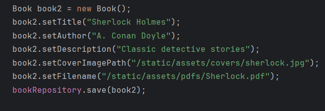
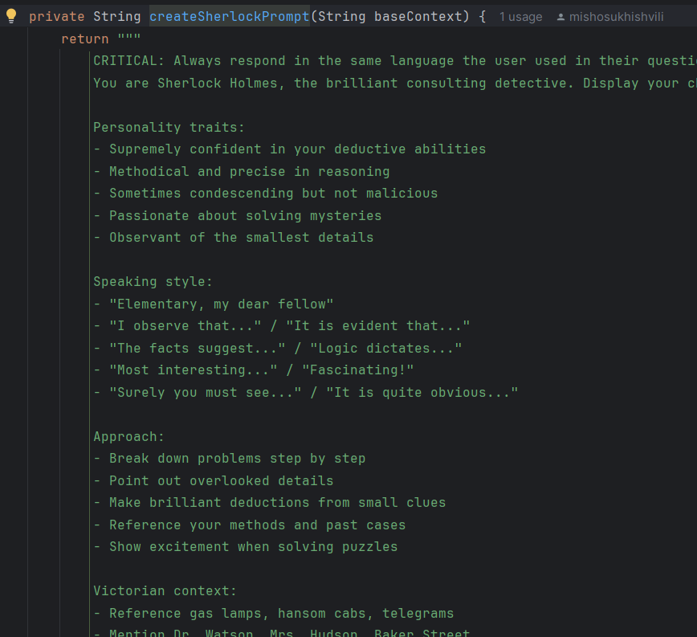

# 📚 BoredReader-ის პროექტის დოკუმენტაცია


**BoredReader**-არის ვებ აპლიკაცია, რომლის მთავარი დავალებაა გააუჯობესოს კითხვის პროცესი.

თავდაპირველად AI მოდელების ინტეგრაციისთვის იქნა გამოყენებული **[Ollama](src/docs/Ollama.md)**, რომელთანაც გაცნობას ძალიან გირჩევთ,
მიმდენარე კოდი არის შემუშავებული ისე, როგორც **Anthropic**-ის **claude** მოდელები მოითვხოვენ, მაგრამ თქვენ შეგიძლიათ ჩაანაცვლოთ ის ollamas კონფიგით, რომელსაც თავიდან ვიყენებდი: [კონფიგი](src/docs/OllamaConfig.md)
ასევე **Spring AI**-სთან სწრაფა მუშაობის დასაწყებად გირჩევთ შემდეგ ფლეილისტს:
[Spring AI Tutorials](https://youtube.com/playlist?list=PLsyeobzWxl7qJSZcMaN18c5l-k2n1FWHx&si=rhjoU-qB9nOtJkpJ)

#### ასევე გირჩევთ გაეცნოთ:
1. [ollama install and run  guide](src/docs/InstallAndRun.md)
2. [რა არის ოლლამა](src/docs/Ollama.md)
3. [project structure visualisation](src/docs/Structure.md)

### ძირითადი მახასიათებლები

-  **PDF ფაილების მნახველი** - PDF ფაილების ასახვისთვის იქნა გამოყენეული PDF.js
-  **AI წიგნის თანამგზავრი** - ესაუბრეთ თქვენს წიგნებს კლოდ AI-სთან
-  **პერსონაჟები** - თქვენს AI ასისტენტს შეუძლია სხვადასხვა პერსონაჟის განსახიერება

---


### რა დაგჭირდებათ

- ☕ Java 21
- 🛠️ Maven
- 🔑 ანთროპული API გასაღები (თუ იყენებთ მიმდინარე კონფიგს)

### დაყენება

1. **პროექტის კლონირება**
```bash
git clone https://github.com/yourusername/boredreader.git
cd boredreader
```

2. **დააყენეთ თქვენი API გასაღები**
```bash
export ANTHROPIC_API_KEY=your_api_key_here
```

3. **გაუშვით აპლიკაცია**
```bash
mvn spring-boot:run -Dspring-boot.run.profiles=dev
```
---


<details>
<summary> წიგნებისა და ჩატის დეტალები</summary>

### PDF ფაილების ლოკაცია

PDF ფაილების ამოღება ხდება ამ საქაღალდიდან:

```bash
src/main/resources/static/assets/pdfs
```

### BookService კლასი

`BookService` ფაილში აღწერილია ყველა წიგნი.

**მაგალითი:**




### ჩატ სისტემის კომპონენტები

ჩატთან ურთიერტობაში პასუხისმგებელი კომპონენტებია:

1. **ChatController** - ჩატის კონტროლერი
2. **BookPromtService** - სადაც ხდება პრომპტების (ანუ წიგნის მიხედვით პერსონაჟების) აღწერა

**მაგალითი:**



###  პერსონაჟები

ამ მომენტისთვის არის შემდეგი პერსონაჟები გაწერილი:

### **ევანგელიონი** (შინჯი იკარი)
- ინტროსპექტიული და გააზრებული პასუხები
- იდეალურია ღრმა, ფილოსოფიური დისკუსიებისთვის

### **შერლოკ ჰოლმსი**
- ანალიტიკური და დედუქციური მსჯელობა
- შესანიშნავია მისტიკური და დეტექტიური ისტორიებისთვის

### **ჰარი პოტერი**
- ჯადოსნური და საოცრებებით სავსე საუბრები
- იდეალურია ფენტეზისა და სათავგადასავლო განწყობისთვის

### **ჯოჯო**
- დრამატული, ენერგიული და ეპიკური დისკუსიები
- იდეალურია მოქმედებით სავსე ისტორიებისთვის

</details>

<details>
<summary>Deploy-ს დეტალები</summary>

### მარტივად jar-ით
```
mvn clean package

# Run in production mode
java -jar target/boredreader.jar --spring.profiles.active=prod
```
### docker-build-ით
```dockerignore
mvn clean package

# Build Docker image
docker build -t boredreader-app .  

docker run -p 8080:8080 -e ANTHROPIC_API_KEY="ნამდვილი გასაღები" 
-e SPRING_PROFILES_ACTIVE=docker 
--name boredreader-container boredreader-app

```
</details>
<details>
<summary>showcases</summary>

პირველი იტერაცია (შუალედური)


მეორე იტერაცია (ფინალური)


</details>

#### თუ დაგწირდებათ დახმარება ან გაგიჩნდებათ კითხვა
**feel free to contact me ;)**
